# S-DES

## 作业报告

##### Rebels 小组 成员：唐一月 翁嘉阳

### 第一关：基本测试

#### GUI首页界面展示：

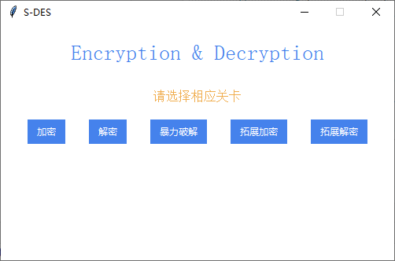

#### 普通加密解密

输入密钥为1111111110，明文为01111111进行加密测试：

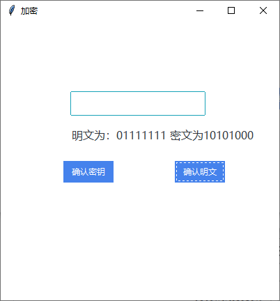

输入密钥为1111111110，密文为10101000进行解密测试：

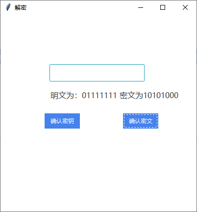

### 第二关：交叉测试

Rebels组：

明文：plaintext = [1, 1, 1, 1, 1, 1, 1, 1]

密钥：key = [0,0,1,1,1,0,1,0,1,0]

所得的密文：[0, 0, 1, 1, 1, 0, 1, 0] 

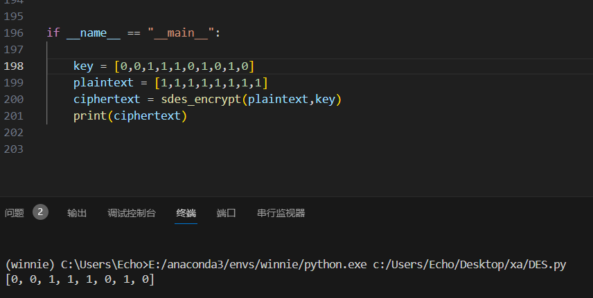

Beta组：

密文：ciphertext = [0, 0, 1, 1, 1, 0, 1, 0]

密钥：key= [0,0,1,1,1,0,1,0,1,0]

所得的明文：[1, 1, 1, 1, 1, 1, 1, 1]

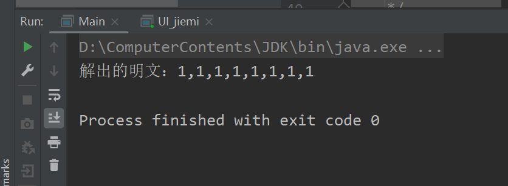

如图所示，交叉测试通过。

### 第三关 拓展功能

#### 拓展加密

输入密钥为1111111111，明文为AT进行加密测试：

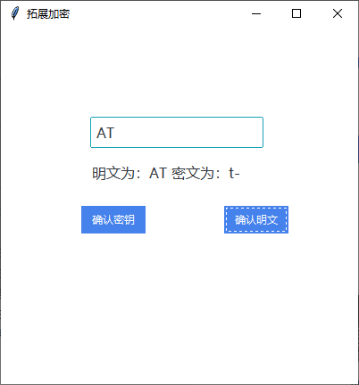

#### 拓展解密

输入密钥为1111111111，明文为t-进行加密测试：

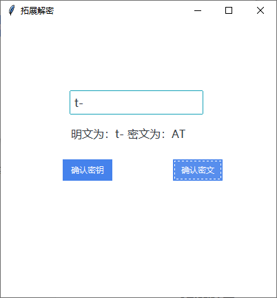

### 第四关：暴力破解

#### 单线程暴力破解

输入明文11111110，密文为11001110进行密钥破解测试：

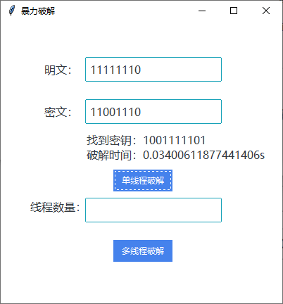

找不到密钥例子：

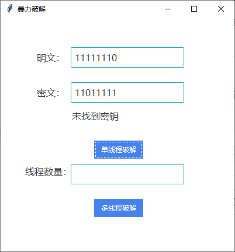

#### 多线程暴力破解

输入明文11111110，密文为01111111进行密钥破解测试：

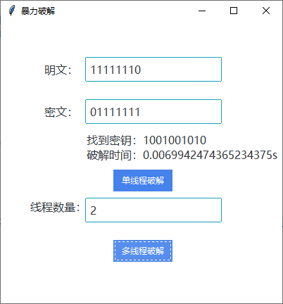

### 第五关：封闭测试

输入以及结果：

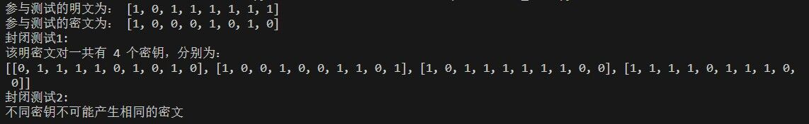


## S-DES 加密系统开发手册

### 1.S-DES算法原理

S-DES（Simplified Data Encryption Standard）是一种简化版的DES（Data Encryption Standard）算法，用于对数据进行加密和解密。它是一种对称密钥算法，即加密和解密使用相同的密钥。

S-DES的算法原理如下：

1. 密钥生成：使用一个10位的密钥，经过置换和分割操作生成两个8位的子密钥K1和K2。

2. 初始置换（IP置换）：将8位的明文按照固定的置换表进行重排，得到L0和R0，每个部分各4位。

3. 轮函数（Round Function）：共进行两轮，每轮包括以下步骤：
   - 扩展置换（Expansion Permutation）：将Ri-1的4位扩展为8位，得到E(Ri-1)。
   - 异或运算（XOR）：将E(Ri-1)与子密钥Ki进行异或运算，得到8位的结果。
   - S盒替换（S-Box Substitution）：将8位结果分为两个4位的部分，分别经过S盒替换，得到4位的结果。
   - P置换（Permutation）：将4位的结果按照固定的置换表进行重排，得到4位的结果。

4. 交换和合并：将经过两轮轮函数得到的L2和R2交换位置，得到R2L2。

5. 逆初始置换（Inverse Initial Permutation）：将R2L2按照固定的置换表进行重排，得到最终的8位密文。

S-DES的解密过程与加密过程相似，只是子密钥的使用顺序与加密过程相反。

### 2.界面设计

GUI界面通过tkinter、ttkinter实现。ttkinter是Python的一个GUI（图形用户界面）工具包，它是基于Tkinter的一个扩展。Tkinter是Python标准库中的一个模块，用于创建GUI应用程序。ttkinter提供了一组更现代化、更美观的GUI控件，比Tkinter原生的控件具有更多的功能和样式。本页面采用了丰富的控件，如label、input、button等等。功能跳转则采用了Toplevel进行实现。Toplevel是Tkinter中的一个窗口类，用于创建一个独立的顶层窗口，其可以设置各种属性，包括窗口标题、大小、位置、最大化、最小化等。

```python
# 创建窗体
win = tk.Tk()
win.title("S-DES")
win.geometry("500x300")
win.resizable(False, False) # 不允许改变窗口大小

# 创建一个容器来包括其他控件
frame = ttk.Frame(win)

frame.pack()

# 标题
title = ttk.Label(frame,text='Encryption & Decryption', font=("bold", 20), bootstyle='primary' )
title.pack(padx=10,pady=20)
# 关卡提示
info = ttk.Label(frame,text='请选择相应关卡',bootstyle='warning', font=15)
info.pack(padx=10,pady=10)
# 按钮
b1 = ttk.Button(frame, text="加密", command=lambda:create(0))
b1.pack(padx=15,pady=10,side='left')

b2 = ttk.Button(frame, text="解密", command=lambda:create(1))
b2.pack(padx=15,pady=10,side='left')

b3 = ttk.Button(frame, text="暴力破解", command=lambda:createT())
b3.pack(padx=15,pady=10,side='left')

b4 = ttk.Button(frame, text="拓展加密", command=lambda:create(3))
b4.pack(padx=15,pady=10,side='left')

b5 = ttk.Button(frame, text="拓展解密", command=lambda:create(4))
b5.pack(padx=15,pady=10,side='left')
frame.mainloop()
```

[^]: 主体窗口界面创建

主体界面展示：


```python
# 跳转页面
def create(fun) :
    # 定义StringVar
    l_text = StringVar()
    # 初始化数据

    childW1 = Toplevel(frame)  # 创建子窗口
    childW1.geometry("400x400")
    if(fun==0) :
        text = "请输入10位密钥"
        l_text.set(text)
        childW1.title('加密')
        b1 = ttk.Button(childW1, text="确认密钥", command=lambda: getText1(input1, l_text,0))
        b2 = ttk.Button(childW1, text="确认明文", command=lambda: getText2(input1, l_text,0))
    elif(fun==1):
        text = "请输入10位密钥"
        l_text.set(text)
        childW1.title('解密')
        b1 = ttk.Button(childW1, text="确认密钥", command=lambda: getText1(input1, l_text, 1))
        b2 = ttk.Button(childW1, text="确认密文", command=lambda: getText2(input1, l_text, 1))
    elif(fun==3):
        text = "请输入10位密钥"
        l_text.set(text)
        childW1.title('拓展加密')
        b1 = ttk.Button(childW1, text="确认密钥", command=lambda: getText1(input1, l_text, 3))
        b2 = ttk.Button(childW1, text="确认明文", command=lambda: getText2(input1, l_text, 3))
    elif (fun == 4):
        text = "请输入10位密钥"
        l_text.set(text)
        childW1.title('拓展解密')
        b1 = ttk.Button(childW1, text="确认密钥", command=lambda: getText1(input1, l_text, 3))
        b2 = ttk.Button(childW1, text="确认密文", command=lambda: getText2(input1, l_text, 3))
    input1 = ttk.Entry(childW1, bootstyle="info", font=("微软雅黑", 12))
    input1.place(x=100,y=100)
    label = ttk.Label(childW1, textvariable=l_text, font=("微软雅黑", 12))
    label.place(x=100,y=150)
    b1.place(x=90, y=200)
    b2.place(x=250, y=200)
   
#暴力破解界面
def createT():
    # 定义StringVar
    l_text = StringVar()
    text='请输入8位明文和8位密文'
    l_text.set(text)
    childW3 = Toplevel(frame)  # 创建子窗口
    childW3.geometry("400x400")
    childW3.title('暴力破解')
    label1 = ttk.Label(childW3, text='明文：', font=("微软雅黑", 12))
    label2 = ttk.Label(childW3, text='密文：', font=("微软雅黑", 12))
    label3 = ttk.Label(childW3, textvariable=l_text, font=("微软雅黑", 12))
    label4 = ttk.Label(childW3, text='线程数量：', font=("微软雅黑", 12))
    input1 = ttk.Entry(childW3, bootstyle="info", font=("微软雅黑", 12))
    input2 = ttk.Entry(childW3, bootstyle="info", font=("微软雅黑", 12))
    input3 = ttk.Entry(childW3, bootstyle="info", font=("微软雅黑", 12))
    btn1 = ttk.Button(childW3, text="单线程破解", command=lambda: getT1(input1, input2, l_text))
    btn2 = ttk.Button(childW3, text="多线程破解", command=lambda: getT2(input1, input2, input3, l_text))
    label1.place(x=60,y=55)
    input1.place(x=120,y=50)
    label2.place(x=60,y=115)
    input2.place(x=120,y=110)
    label3.place(x=120,y=155)
    btn1.place(x=160,y=210)
    label4.place(x=40,y=250)
    input3.place(x=120,y=250)
    btn2.place(x=160,y=310)
```

[^]: 创建跳转子窗口

加密解密窗口页面：

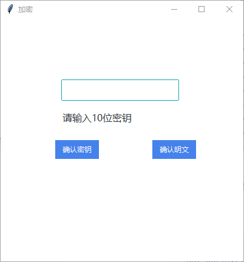

暴力破解界面：

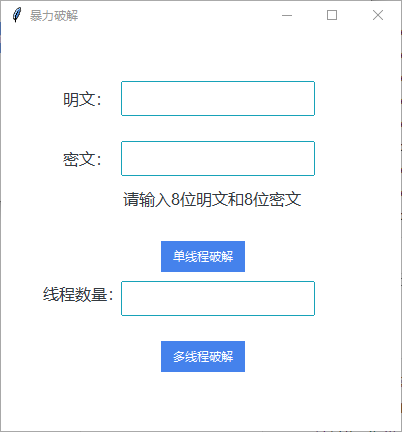

```python
# button1 得到第一次输入，并对不符合输入规范的操作进行提示
def getText1(input1,l_text,fn):
    if(fn==0 or fn ==1 or fn == 3 or fn == 4):
        if(len(input1.get())!=10):
            text = '输入密钥不符合10位规范'
            l_text.set(text)
            return

        global key
        key = [ int(x) for x in str(input1.get()) ]
        input1.delete(0, "end")
        if(fn==0):
            text = '请输入8位明文。'
        elif(fn==1):
            text = '请输入8位密文。'
        elif(fn==3 or fn == 4):
            text='请输入一个英文字符串'
        l_text.set(text)
        return

# button2 得到第二次输入，调用函数实现最终功能，并展现结果
def getText2(input1,l_text,fn):
    if(fn==0):
        if(len(input1.get())!=8):
            text = '输入明文不符合8位规范'
            l_text.set(text)
            return
        global plaintext
        plaintext = [ int(x) for x in str(input1.get()) ]
        ciphertext1 = sdes_encrypt(plaintext, key)
        str1 = ''.join(str(i) for i in plaintext)
        str2 = ''.join(str(i) for i in ciphertext1)
        text = '明文为：' + str1 + ' 密文为' + str2
        print(text)
        l_text.set(text)
        input1.delete(0, "end")
        return
    elif(fn==1):
        if (len(input1.get()) != 8):
            text = '输入密文不符合8位规范'
            l_text.set(text)
            return
        global ciphertext
        ciphertext = [ int(x) for x in str(input1.get()) ]
        plaintext1 = sdes_decrypt(ciphertext,key)
        str1 = ''.join(str(i) for i in plaintext1)
        str2 = ''.join(str(i) for i in ciphertext)
        text = '明文为：' + str1 + ' 密文为' + str2
        l_text.set(text)
        print(text)
        input1.delete(0, "end")
        return
    elif(fn==3):
        plaintext2 = input1.get()
        if(len(plaintext2)==0):
            text = '输入不能为空'
            l_text.set(text)
            return
        text = encrypt_string(plaintext2,key)
        text = '明文为：' + plaintext2 + ' 密文为：' + text
        l_text.set(text)
    elif (fn == 4):
        ciphertext2 = input1.get()
        if (len(ciphertext2) == 0):
            text = '输入不能为空'
            l_text.set(text)
            return
        text = decrypt_string(ciphertext2, key)
        text = '密文为：' + text + ' 明文为：' + ciphertext2
        l_text.set(text)
# 暴力破解的按键功能实现
# 单线程btn1
def getT1(input1, input2, l_text):
    if (len(input1.get()) != 8 and len(input2.get())!=8):
        text = '输入不符合8位规范'
        l_text.set(text)
        return
    plaintext3 = [ int(x) for x in str(input1.get()) ]
    ciphertext3 = [ int(x) for x in str(input2.get()) ]
    found_key, elapsed_time = brute_force_attack1(ciphertext3, plaintext3)

    if found_key is not None:
        str1 = ''.join(str(i) for i in found_key)
        text = '找到密钥：'+str1 + '\n' +'破解时间：' + str(elapsed_time) + 's'
        l_text.set(text)
    else:
        text='未找到密钥'
        l_text.set(text)
start_time = 0
# 多线程btn2：
def getT2(input1, input2, input3, l_text):
    if (len(input1.get()) != 8 and len(input2.get())!=8):
        text = '输入不符合8位规范'
        l_text.set(text)
        return
    elif(len(input3.get())==0):
        text = '请输入线程数！'
        l_text.set(text)
        return
    plaintext3 = [int(x) for x in str(input1.get())]
    ciphertext3 = [int(x) for x in str(input2.get())]
    num_threads = int(input3.get())
    keys_per_thread = 1024 // num_threads
    found_key = None
    elapsed_time = None
    result_dict = {'found_key': None, 'elapsed_time': None}
    global start_time
    start_time = time.time()

    # 创建并启动多个线程
    threads = []
    for i in range(num_threads):
        start_key = i * keys_per_thread
        end_key = start_key + keys_per_thread
        thread = threading.Thread(
            brute_force_attack2(ciphertext3, plaintext3, start_key, end_key, result_dict, num_threads))
        threads.append(thread)
        thread.start()

    for thread in threads:
        thread.join()

    found_key = result_dict['found_key']
    elapsed_time = result_dict['elapsed_time']

    if found_key is not None:
        str1 = ''.join(str(i) for i in found_key)
        text = '找到密钥：' + str1 + '\n' + '破解时间：' + str(elapsed_time) + 's'
        l_text.set(text)
    else:
        text = '未找到密钥'
        l_text.set(text)

```


[^]: 按键功能实现

当用户输入不规范时进行提示：

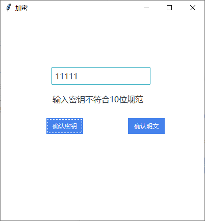

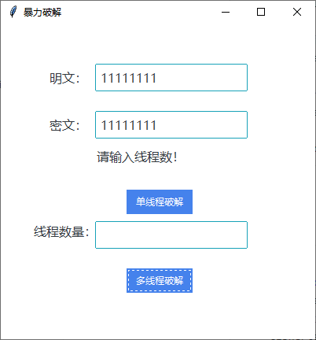

导入的库：

```python
import ttkbootstrap as ttk
import tkinter as tk
from tkinter import *
from ttkbootstrap import StringVar
```


### 3.S-DES算法具体功能实现

- #### 转换装置设置

  ```python
  # S-DES S-boxes
  s_box_0 = [
      [1, 0, 3, 2],
      [3, 2, 1, 0],
      [0, 2, 1, 3],
      [3, 1, 0, 2]
  ]

  s_box_1 = [
      [0, 1, 2, 3],
      [2, 3, 1, 0],
      [3, 0, 1, 2],
      [2, 1, 0, 3]
  ]

  # Initial permutation
  initial_permutation = [1,5,2,0,3,7,4,6]
                      
  # Expansion permutation
  expansion_permutation = [3,0,1,2,1,2,3,0]

  # Inverse initial permutation
  inverse_initial_permutation = [3, 0, 2, 4, 6, 1, 7, 5]

  # P4 permutation
  p4_permutation = [1,3,2,0]

  # P10 permutation
  p10_permutation = [2, 4, 1, 6, 3, 9, 0, 8, 7, 5]

  # P8 permutation
  p8_permutation = [5, 2, 6, 3, 7, 4, 9, 8]
  ```

- #### 密钥生成

  ```python
  # Key generation
  def generate_round_keys(key):
      key = [key[p] for p in p10_permutation]
      left_half = key[:5]
      right_half = key[5:]

      # Left circular shift
      left_half = left_half[1:] + [left_half[0]]
      right_half = right_half[1:] + [right_half[0]]

      round_key_1 = [left_half[i] for i in [0, 1, 2, 3, 4]] + [right_half[i] for i in [0, 1, 2, 3, 4]]
      round_key_2 = [left_half[i] for i in [3, 4, 0, 1, 2]] + [right_half[i] for i in [3, 4, 0, 1, 2]]

      round_key_1 = [round_key_1[p] for p in p8_permutation]
      round_key_2 = [round_key_2[p] for p in p8_permutation]

      return round_key_1, round_key_2
  ```

  ​

- #### 初始置换（IP置换）

  ```python
  # Initial permutation
  def initial_permute(plaintext):
      return [plaintext[p] for p in initial_permutation]
  ```

  ​

- #### 轮函数（Round Function）：共进行两轮，每轮包括以下步骤：

  - [ ] 扩展置换（Expansion Permutation）：将Ri-1的4位扩展为8位，得到E(Ri-1)。

    ```python
    # Expansion permutation
    def expansion(plaintext):
        return [plaintext[p] for p in expansion_permutation]
    ```

    ​

  - [ ] 异或运算（XOR）：将E(Ri-1)与子密钥Ki进行异或运算，得到8位的结果。

    ```python
    # XOR operation
    def xor(left, right):
        return [l ^ r for l, r in zip(left, right)]
    ```

    ​

  - [ ] S盒替换（S-Box Substitution）：将8位结果分为两个4位的部分，分别经过S盒替换，得到4位的结果。

    ```python
    # S-box substitutioncls
    def s_box_substitution(four_bits, s_box):
        row = int(str(four_bits[0]) + str(four_bits[3]), 2)
        col = int(str(four_bits[1]) + str(four_bits[2]), 2)
        return [int(bit) for bit in bin(s_box[row][col])[2:].zfill(2)]
    ```

    ​

  - [ ] P置换（Permutation）：将4位的结果按照固定的置换表进行重排，得到4位的结果

    ```python
    # P4 permutation
    def p4(plaintext):
        return [plaintext[p] for p in p4_permutation]
    ```

    ​

  - [ ] 总的轮函数f：

    ```python
    # F function
    def f(right_half, round_key):
        expanded = expansion(right_half)
        xor_result = xor(expanded, round_key)
        s_box_output = s_box_substitution(xor_result[:4], s_box_0) + s_box_substitution(xor_result[4:], s_box_1)
        return p4(s_box_output)
    ```

- #### 加密函数

  ```python
  # 加密
  def sdes_encrypt(plaintext, key):
      round_key_1, round_key_2 = generate_round_keys(key)
      # 初始置换
      plaintext = initial_permute(plaintext)
      left_half, right_half = plaintext[:4], plaintext[4:]

      # 第一轮F函数
      f1_result = f(right_half, round_key_1)

      # 异或操作
      xor_result = xor(left_half, f1_result)

      # 交换左半部分和右半部分
      left_half, right_half = right_half, xor_result

      # 第二轮F函数
      f2_result = f(right_half, round_key_2)

      # 异或操作
      xor_result = xor(left_half, f2_result)

      # 加密结果
      ciphertext = xor_result + right_half

      # 逆初始置换
      ciphertext = inverse_initial_permute(ciphertext)

      return ciphertext
  ```

  ​

- #### 解密函数

  ```python
  # 解密
  def sdes_decrypt(ciphertext, key):
      round_key_1, round_key_2 = generate_round_keys(key)
      # 初始置换
      ciphertext = initial_permute(ciphertext)
      
      left_half, right_half = ciphertext[:4], ciphertext[4:]

      # 第一轮F函数
      f1_result = f(right_half, round_key_2)

      # 异或操作
      xor_result = xor(left_half, f1_result)

      # 交换左半部分和右半部分
      left_half, right_half = right_half, xor_result

      # 第二轮F函数
      f2_result = f(right_half, round_key_1)

      # 异或操作
      xor_result = xor(left_half, f2_result)

      # 加密结果
      plaintext = xor_result + right_half

      # 逆初始置换
      plaintext = inverse_initial_permute(plaintext)

      return plaintext
  ```

  ​

- #### 字符串转为ASCII

  ```python
  def trans_string_To_asc(input_string):
      # 输入字符串
      input_string = input_string
      # 初始化空列表
      list_ascii = []
      # 遍历字符串中的每个字符
      for char in input_string:
          # 获取字符的ASCII码
          ascii_code = ord(char)
          # 将ASCII码转化为8位二进制串，并且用0填充至8位
          binary_string = format(ascii_code, '08b')
          # 将二进制串转化为一个包含8个整数的列表
          binary_list = [int(bit) for bit in binary_string]
          # 将binary_list添加到list1中
          list_ascii.append(binary_list)
      return list_ascii
  ```

  ​

- #### ASCII转为字符串

  ```python
  def trans_asc_To_string(list_ascii):
      result_string = ""
      # 遍历二维数组中的每个二进制列表
      for binary_list in list_ascii:
          # 将二进制列表转化为字符并添加到结果字符串
          ascii_code = int(''.join(map(str, binary_list)), 2)
          character = chr(ascii_code)
          result_string += character
      return result_string
  ```

  ​

- #### 拓展加密函数

  ```python
  def encrypt_string(plaintext,key):
      plain_list = trans_string_To_asc(plaintext)
      cipher_list = []
      for plain_char in plain_list:
          cipher_char = sdes_encrypt(plain_char,key)
          cipher_list.append(cipher_char)
      return trans_asc_To_string(cipher_list)
  ```

  ​

- #### 拓展解密函数

  ```python
  def decrypt_string(ciphertext,key):
      cipher_list = trans_string_To_asc(ciphertext)
      plain_list = []
      for cipher_char in cipher_list:
          plain_char = sdes_decrypt(cipher_char,key)
          plain_list.append(plain_char)
      return trans_asc_To_string(plain_list)
  ```

  ​

- #### 暴力破解

  ```python
  # 暴力破解攻击以找到密钥
  def brute_force_attack1(ciphertext, plaintext):
      start_time = time.time()
      for possible_key in range(1024):  # 尝试所有可能的10位密钥
          key = [int(bit) for bit in f"{possible_key:010b}"]
          decrypted_text = sdes_decrypt(ciphertext, key)
          if decrypted_text == plaintext:
              end_time = time.time()
              elapsed_time = end_time-start_time
              return key,elapsed_time
      return None,None

  def string_brute_force_attack(ciphertext, plaintext):
      cipher_list = trans_string_To_asc(ciphertext)
      plain_list = trans_string_To_asc(plaintext)
      return brute_force_attack(cipher_list[0],plain_list[0])

  # 多线程暴力破解
  def brute_force_attack2(ciphertext, plaintext, start_key, end_key, result_dict,num_threads):
      num_threads = num_threads
      for possible_key in range(start_key, end_key):
          key = [int(bit) for bit in f"{possible_key:010b}"]
          decrypted_text = sdes_decrypt(ciphertext, key)
          if decrypted_text == plaintext:
              result_dict['found_key'] = key
              result_dict['elapsed_time'] = time.time() - start_time
              break
    
  ```


需要引入的库：

```python
import time
import threading
```

- #### 封闭测试代码

  ```python
  from DES import sdes_decrypt,trans_string_To_asc,sdes_encrypt


  def closed_beta_key(plaintext,ciphertext):
      key_list = []
      print("封闭测试1:",end='\n')
      for possible_key in range(1024):  # 尝试所有可能的10位密钥
          key = [int(bit) for bit in f"{possible_key:010b}"]
          if plaintext == sdes_decrypt(ciphertext,key):
              key_list.append(key)
      print("该明密文对一共有",len(key_list),"个密钥，分别为：")
      print(key_list,end='\n')
      return None

  def closed_beta_plaintext(plaintext):
      print("封闭测试2:",end='\n')
      ciphertext_list = []
      has_duplicates = False
      for possible_key in range(1024):
          key = [int(bit) for bit in f"{possible_key:010b}"]
          ciphertext_list.append(sdes_encrypt(plaintext,key))
      
      for i in range(len(ciphertext_list)):
          for j in range(i+1):
              if ciphertext_list[i] ==ciphertext_list[j]:
                  has_duplicates = False
                  break           
      if has_duplicates:
          print("不同的密钥可能会产生相同的密文")
      else:
          print("不同密钥不可能产生相同的密文") 
              

  if __name__ == "__main__":
      plaintext = [1,0,1,1,1,1,1,1]
      ciphertext = [1, 0, 0, 0, 1, 0, 1, 0]
      print("参与测试的明文为：",plaintext)
      print("参与测试的密文为：",ciphertext)
      closed_beta_key(plaintext,ciphertext)
      closed_beta_plaintext(plaintext)
  ```

  ​

### 4.用户使用指南

从功能界面选择相应的功能：


跳转到相应页面后，按照提示输入密钥、明文、密文，得到相应的结果，例如：

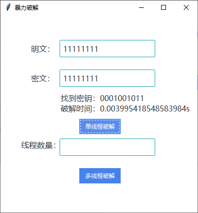

